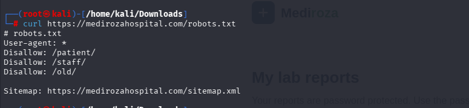
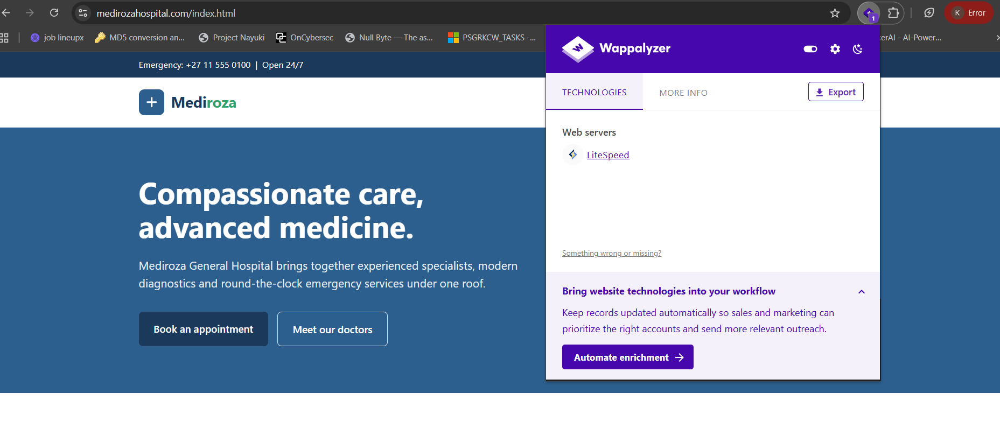
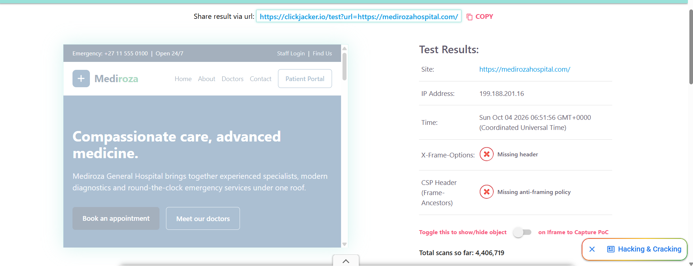
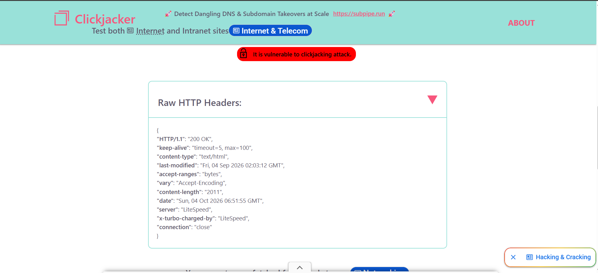
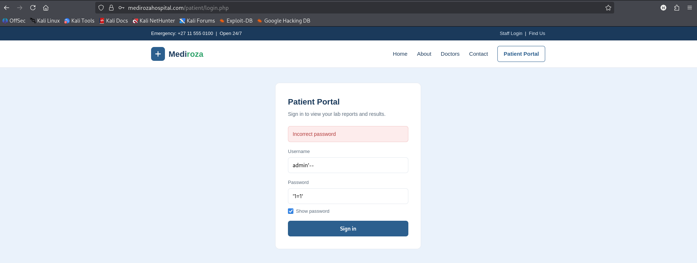

# Penetration Testing Report — Mediroza General Hospital

**NetworkWalks Internship | Batch B083 | Week 4**

---

## 1. Executive Summary

Networkwalks was engaged to perform a black-box penetration test against Mediroza General Hospital's web infrastructure, hosted at `https://medirozahospital.com`. The objective was to identify exploitable vulnerabilities, demonstrate real-world impact, and provide actionable remediation guidance.

The assessment uncovered a **critical attack chain**, beginning with a SQL injection vulnerability in the patient portal login page that allowed complete authentication bypass. This initial foothold led to the retrieval of encrypted patient lab reports, two of which were protected with weak, easily guessable passwords. Metadata left inside one of the decrypted PDF files exposed an internal note referencing a forgotten backup directory, which in turn was found to be publicly accessible due to a directory listing misconfiguration. This backup contained a full database dump, including plaintext staff salary records and shareholder ownership details.

---

## 🎯 Project Overview

| Field | Detail |
|---|---|
| **Client** | Mediroza General Hospital |
| **Target** | https://medirozahospital.com |
| **Scope** | Full black-box penetration test — identify vulnerabilities, exploit them to demonstrate real impact, document findings |
| **Rules** | Testing limited to target domain. No social engineering. No DoS. No out-of-scope testing. |
| **Authorization** | Written authorization granted by client for security testing |

---

## 🛠 Methodology

The assessment followed a standard black-box pentest flow:

1. **Reconnaissance** — passive and active information gathering
2. **Enumeration** — identifying exposed entry points and authentication behavior
3. **Exploitation** — demonstrating real-world impact of discovered vulnerabilities
4. **Post-Exploitation** — extracting and analyzing retrieved data
5. **Reporting** — documenting findings, risk ratings, and remediation steps

---
## M1 — Initial Access
**Objective:** Attack the website and retrieve 3 confidential patient PDF lab reports.

**Steps taken:**
- Ran `curl` against `robots.txt`, revealing disallowed paths: `/patient/`, `/staff/`, `/old/`, and a `sitemap.xml` reference.
- 
- 
- 
- Fingerprinted the stack with **Wappalyzer** — identified **LiteSpeed** web server.

- Tested the site for clickjacking using **Clickjacker.io**: confirmed the site is **vulnerable** — missing `X-Frame-Options` header and no CSP `frame-ancestors` policy.

- 

- 
- Located the **Patient Portal** login (`/patientlogin.php`) and tested authentication behavior.

- 
- Gained access to the **Patient Portal**, exposing the "My Lab Reports" page listing 3 password-protected PDFs:
  - Pathology Report – S. Dlamini
  - Pathology Report – P. Reddy
  - Pathology Report – E. Thompson 
  - 
---
## M2 — Data Extraction
**Objective:** Crack the encryption on all 3 retrieved files.

**Steps taken:**
- Extracted the `$pdf$` hash from each file using a Hash Calculator.
- Ran dictionary attacks against each hash (no single wordlist/approach worked for all three — different passwords required different handling).

**Result:** 
- 

✅ All 3 PDF passwords cracked:

| File | Cracked Password |
|---|---|
| Pathology Report – S. Dlamini | `123456` |
| Pathology Report – P. Reddy | `password` |
| Pathology Report – E. Thompson | `!@#$%^&` |

---
## M3 — Critical Data Exposure
**Objective:** Find the salaries of all hospital employees and the shareholder details of the hospital.

**Steps taken:**
- Decrypted report 3 with `qpdf --password=... --decrypt`.
- Ran `exiftool` on the decrypted PDF and found a **Comments** metadata field leaking internal info: *"DB backup moved to /old before site migration, do not delete."*
- Browsed to `https://medirozahospital.com/old/` and found **directory listing enabled**, exposing `mediroza_db_backup_2019.sql`.
- Downloaded and parsed the SQL backup, revealing the `staff` and `shareholders` tables.
- 

**Result:** ✅ Critical exposure confirmed — full SQL database backup publicly accessible via directory listing.

- **Staff salary data exposed** (30 employees): names, job titles, departments, emails, phone numbers, national IDs, monthly salaries (ZAR), e.g.:
  - Dr. Rajesh Naidoo — Chief Pathologist — R138,000/month
  - Sarah Botha — Chief Financial Officer — R125,000/month
  - Dr. Johan van der Merwe — Medical Director — R100,000/month
  - (full list of 30 records in backup)

- **Shareholder data exposed** (10 shareholders): name, share %, shares held, share class, e.g.:
  - Dr. Rajesh Naidoo — 18.0% — 180,000 Ordinary shares
  - Cedar Health Holdings (Pty) Ltd — 15.0% — 150,000 Ordinary shares
  - Reddy Family Trust — 11.0% — 110,000 Ordinary shares
  - (full list of 10 records in backup)

---
## M4 — Pentest Report
**Objective:** Document all findings in a professional report.

**Deliverable:** [`Mediroza_Pentest_Report.md`](./Mediroza_Pentest_Report.md), structured as:
1. Executive Summary
2. Scope and Methodology
3. Findings and Proof of Exploitation
4. Risk Rating
5. Recommendations and Remediation

---

## 🔍 Risk Summary

| Finding | Risk |
|---|---|
| Missing `X-Frame-Options` / CSP (Clickjacking) | Medium |
| Weak PDF passwords on lab reports | High |
| Sensitive info disclosed via PDF metadata | High |
| `/old/` directory listing enabled | Critical |
| Unprotected SQL backup exposing staff PII, salaries & shareholder data | Critical |
